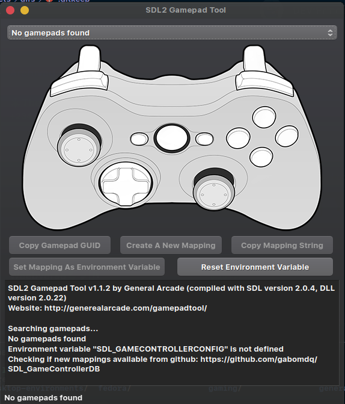
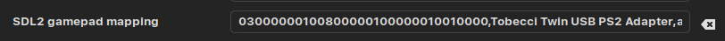

[up](./README.md)

# How to remap gamepad buttons in lutris

## step 1
install the package [gamepad tool](https://aur.archlinux.org/packages/gamepad-tool-bin)

## step 2
launch the program with `gamepad-tool` (terminal only)

you get whhat is seen below

## step 3
click `create new mapping` the remap the buttons

## step 4
click `copy mapping string` (copies the mapping string to your clipboard)

## step 5
open lutris

- right-click on the game
- click `configure`
- navigate to `system options` tab
- paste the copied string in the `SDL2 gamepad mapping` field (looks like below)  

- start the game